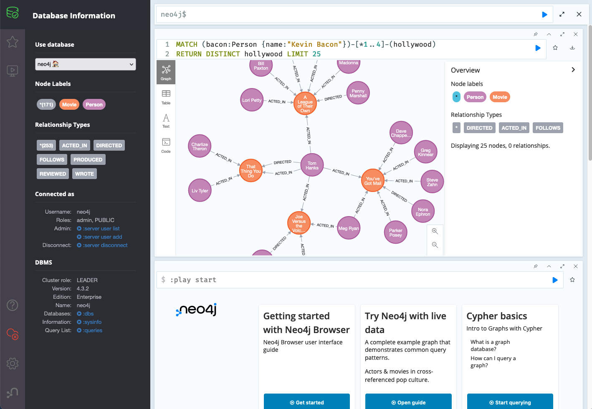

# ONgDB Browser

ONgDB Browser is a fork of Neo4j Browser and is the general purpose graphical user interface for working with ONgDB. Query, visualize, administrate and monitor the database
with modern and easy-to-use tools.



## Demo

You can try out the latest (unreleased) version of Neo4j Browser at [http://browser-canary.graphapp.io/](http://browser-canary.graphapp.io/).

Keep in mind that you will need to connect to an instance of Neo4j (the database) for most operations in Neo4j Browser. A simple way to get started is through [Neo4j Desktop](https://neo4j.com/download/). Once you've started a database it's by default available for Neo4j Browser to connect to on **localhost:7687**.

## Feedback & Contributing

Found a bug or some other problem with Neo4j Browser? Please [**open an issue**](https://github.com/neo4j/neo4j-browser/issues).

Have an idea for a new feature? You're welcome to leave suggestions and ideas [here](https://neo4j-browser.canny.io/feature-requests).

Contributions welcome! More information in our [CONTRIBUTING.md](CONTRIBUTING.md).

## Project structure

`yarn e2e` to run the cypress js test suite (requires a **fresh** installation of neo4j to run against, expects neo4j 4.4 by default).
`yarn e2e --env server=3.4` to only run cypress js tests valid for neo4j server version 3.4.

To run on an existing server (with a password already set), you can use any of these (the default password is set to "newpassword", pass in `--env browser-password=your-password`): 
`yarn e2e-local --env server=4.4` 
`yarn e2e-local-open --env server=4.4` 
The latter just opens Cypress runner so you can see the tests being executed and run only some of them. Very useful when writing tests.

There are also e2e tests that cover import from CSV files. To run these, copy the `e2e_tests/files/import.csv` to the `import/` directory of the database you want to run the tests on and then start the e2e tests with the `--env include-import-tests=true` flag.
Example: `yarn e2e-local-open --env server=4.4,include-import-tests=true`

Browser has a subproject of re-usable components bundled together and exposed as `neo4j-arc`. Rather than set up mono-repo tooling the we've set up eslint to isolate `neo4j-arc` and given it a seperate build step. Code in browser can only to import code from `neo4j-arc` through `neo4j-arc` aliases (as if it was a seperate project) and `neo4j-arc` is not allowed to import any code from outside it's own folder.

## Development

Running Neo4j Browser locally requires Node.js (^12.4.0) and for dependencies we use yarn (`npm install -g yarn`).
To install dependencies and then start the development server at `http://localhost:8080`:

```shell
yarn install
yarn start
```

Or to run in production mode:

```shell
yarn start-prod
```

### Testing overview

Neo4j Browser has both unit and end to end tests running automatically on every pull request. To run the tests locally:

`yarn test-unit` runs a linter and then our unit tests.

`yarn test-e2e` runs our Cypress end to end tests in the easiest, slowest way. Running them with this command requires docker installed and that nothing else runs on ports 7687 and 8080.

#### Cypress e2e test suite in depth

`yarn e2e-open` to open the Cypress test runner (requires a **fresh** installation of Neo4j to run against, expects neo4j 3.5 by default). See details below on how to configure database version.

`yarn e2e-local-open` to run against an existing server (with a password already set). We use `newpassword` as the default password here, make sure to pass your password:
`yarn e2e-local-open --env browser-password=<your-password-here>`

To avoid opening the Cypress test runner and just run the tests in the terminal, remove the "-open" suffix from the previous two commands (so `yarn e2e` and `yarn e2e-local` respectively).

So to run tests on your existing 4.4 database with the password "hunter2" without opening the Cypress visual test runner:
`yarn e2e-local --env browser-password=hunter2,server=4.4`

All the available options for `--env` are:

```
server=3.4|4.4 (default 4.4)
edition=enterprise|community (default enterprise)
browser-password=<your-pw> (default 'newpassword')
include-import-tests=true|false (default false)
bolt-url=<bolt url excluding the protocol> (default localhost:7687)
```

There are some additional options that can only be set as system environmental variables (meaning they cannot be set using the `--env` flag as the ones above).
These needs to be set before the test command is run.

```
CYPRESS_E2E_TEST_ENV=local|null (if the initial set of pw should run or not) (default undefined)
CYPRESS_BASE_URL=<url to reach the browser to test> (default http://localhost:8080)
```

Example: `CYPRESS_E2E_TEST_ENV="local" CYPRESS_BASE_URL=http://localhost:30000 cypress open --env server=4.2`

## Devtools

Redux and React have useful devtools, the chrome versions are linked below: 

- [Redux devtools](https://chrome.google.com/webstore/detail/redux-devtools/lmhkpmbekcpmknklioeibfkpmmfibljd?hl=en)
- [React devtools](https://chrome.google.com/webstore/detail/react-developer-tools/fmkadmapgofadopljbjfkapdkoienihi?hl=en)


## Building
Install yarn globally (not homebrew if using osx)
npm install -g yarn
yarn
yarn build
yarn prepare-jar
mvn -o -Duser.name=graphfoundation install # Don't clean install.
