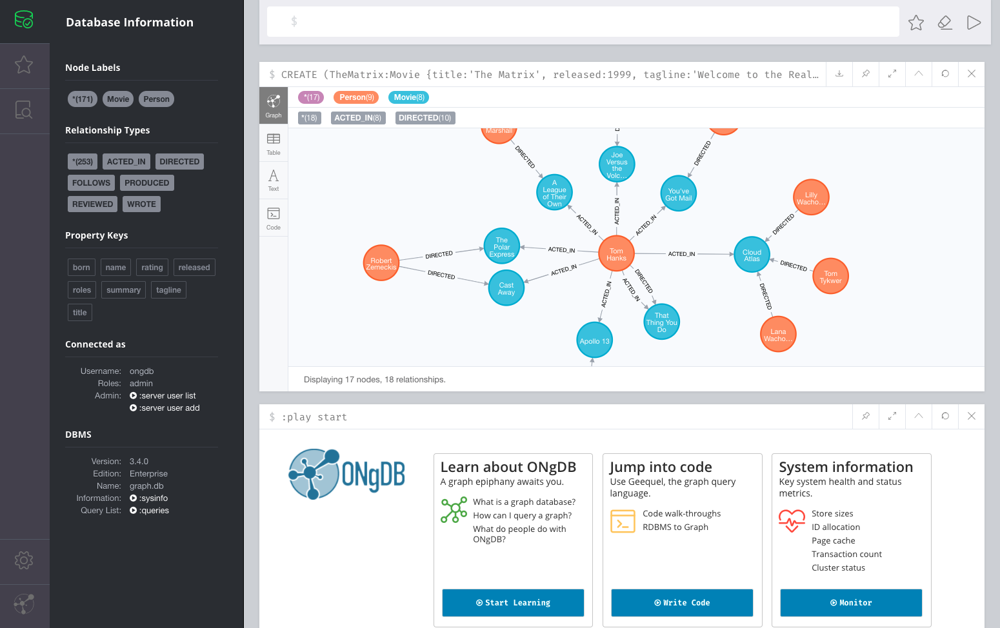

# ONgDB Browser

ONgDB Browser is the general purpose user interface for working with ONgDB to query, visualize, administrate and monitor the database
with modern and easy-to-use tools.



## Development setup

1.  Clone this repo
1.  Install yarn globally (not required but recommended): `npm install -g yarn`
1.  Install project dependencies: `yarn`

### Development server

`yarn start` and point your web browser to `http://localhost:8080`.

### Testing

`yarn test` to run a single test run. A linter will run first.

`yarn dev` to have continuous testing on every file change.

#### E2E Suite

`yarn e2e` to run the cypress js test suite (requires a **fresh** installation of ongdb to run against, expects ongdb 1.0 by default).
`yarn e2e --env server=1.0` to only run cypress js tests valid for ongdb server version 1.0.

To run on an existing server (with a password already set), you can use any of these (the default password is set to "newpassword", pass in `--env browser-password=your-password`):  
`yarn e2e-local --env server=1.0`  
`yarn e2e-local-open --env server=1.0`  
The latter just opens Cypress runner so you can see the tests being executed and run only some of them. Very useful when writing tests.

There are also e2e tests that cover import from CSV files. To run these, copy the `e2e_tests/files/import.csv` to the `import/` directory of the database you want to run the tests on and then start the e2e tests with the `--env include-import-tests=true` flag.
Example: `yarn e2e-local-open --env server=1.0,include-import-tests=true`

Here are the available options / env variables:

```
server=1.0
edition=enterprise|community (default enterprise)
browser-password=<your-pw> (default 'newpassword')
include-import-tests=true|false (default false)
bolt-url=<bolt url excluding the protocol> (default localhost:7687)
```

Test environment options (cannot be set using the `--env` flag as the ones above).
These needs to be set before the test command is run.

```
CYPRESS_E2E_TEST_ENV=local|null (if the initial set of pw should run or not) (default undefined)
CYPRESS_BASE_URL=<url to reach the browser to test> (default http://localhost:8080)
```

Example: `CYPRESS_E2E_TEST_ENV="local" CYPRESS_BASE_URL=http://localhost:8081 cypress open --env server=1.0`

## Devtools

Redux and React have useful devtools, the chrome versions are linked below: 

- [Redux devtools](https://chrome.google.com/webstore/detail/redux-devtools/lmhkpmbekcpmknklioeibfkpmmfibljd?hl=en)
- [React devtools](https://chrome.google.com/webstore/detail/react-developer-tools/fmkadmapgofadopljbjfkapdkoienihi?hl=en)


## Building

### Install tools

Install yarn globally (not homebrew if using osx)

```
npm install -g yarn
```

### Installing

Yarn will build the distribution and package into a jar. That jar will then be bundled by Maven into the full artifact that many be used by ongdb.

It's important to not use the `clean` goal when running `mvn` as it will remove the jar created in the prior steps.

```
yarn
yarn jar
yarn prepare-jar
mvn -o -Duser.name=graphfoundation install
```

### Known issues

You may have problems with node-gym on node 10+. 
You can use nvm and install node 8.15.0 to work with this browser if you have any issues.

## Unaffiliated with Neo4j, Inc.
ONgDB is an independent fork of Neo4j® Enterprise Edition version 3.4.0.rc02 licensed under the AGPLv3 and/or Community Edition licensed under GPLv3.
ONgDB and Graph Foundation, Inc. are not affiliated in any way with Neo4j, Inc. or Neo4j Sweden AB.
Neo4j, Inc. and Neo4j Sweden AB do not sponsor or endorse ONgDB and Graph Foundation, Inc.
Neo4j Sweden AB is the owner of the copyrights for Neo4j® software and commercial use of any source code from Neo4j® Enterprise Edition beyond
Neo4j® Enterprise Edition version 3.2.14, Neo4j® Enterprise Edition version 3.3.10, and/or Neo4j® Enterprise Edition version 3.4.0.rc02 is prohibited
and could subject the user to claims of copyright infringement.
